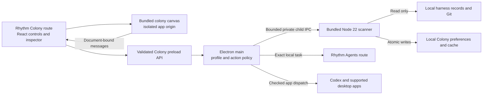

# Colony in Rhythm Electron

Date: 2026-09-18

Status: implementation plan; no Colony integration code has been written

Revised 2026-09-21 to follow the Hermes Desktop adoption shape (see below).

Planning branch: `codex/colony-integration-plan` · [documentation draft #1539](https://github.com/ajhochy/Rhythm/pull/1539)

Audience: all Rhythm desktop users, explicitly opt-in

First platforms: macOS Apple Silicon and Intel

Tracking: [epic #1525](https://github.com/ajhochy/Rhythm/issues/1525) · [milestones and issue dependencies](2026-09-18-electron-colony-tracking.md)

COL-04 design resolution (2026-09-25): the concrete [Bot Crossing workspace packet](../../design/colony/README.md), [complete upstream action inventory](../../design/colony/action-inventory.md), and [D1–D6 decision record](../decisions/2026-09-25-colony-workspace-design.md) supersede the plan-level naming/visibility/lifecycle sketches where they conflict. In particular, the destination is labeled **Bot Crossing**, remains visible before opt-in without starting discovery, and disposes its native document on departure while restoring profile-owned view state on return.

## Goal and confirmed scope

Give Rhythm Electron users a Colony tab that shows their local agent work across harnesses,
opens the correct task, and feels like part of Rhythm. The installed Rhythm app must include
everything needed to run it; users should not need a terminal, a Bot Crossing checkout, or a
separate Node installation.

AJ confirmed all-user opt-in availability and both Mac architectures. AJ also requested a
design pass over the UI and menu items to make them feel native to Rhythm Electron, and
authorized filing this plan as GitHub issues with milestones. This run is planning and issue
creation only. It does not authorize implementation, merge, release publication, or Flutter
retirement.

Preserve the 3D colony, its art and animations, multi-harness discovery, stable repository and
checkout identity, parent/worker relationships, accurate unknown/quiet states, and local
archive/viewed/grouping preferences. Initial integration supports the adapters already present
in the adopted Bot Crossing revision; it does not promise every external app can reopen tasks.
Unsupported actions must explain why instead of opening an unrelated task.

Out of scope: Windows/Linux packages, cloud upload/sync of harness history, shared colonies,
automatic agent execution, a new scheduler, a new plugin marketplace, changing provider
credentials, deleting harness records, and replacing Rhythm's API/engine. Creating new external
sessions or resuming terminal sessions is not part of the first packaged Colony action contract;
those standalone actions remain outside the embedded menu until separately qualified.

## Constraints and design tensions

- Discovery reads harness files and Git metadata only. All writes belong to Colony's own
  profile-scoped state. Never treat a missing historical folder as a live project or blocked bot.
- Keep live API/engine ownership unchanged. A scanner is a separate child owned by this Electron
  instance; it never binds, stops, adopts, or reclaims ports 4001/4096 or any unrelated process.
- Flutter remains the shipping client under the current repository release policy. Completing
  Colony does not satisfy the separate Electron replacement/pilot/cutover gates.
- Reuse the existing renderer and scanner while replacing the surrounding controls with Rhythm
  components. Avoid an all-at-once React rewrite of the 3D simulation.
- Balance a useful large local inventory with responsive UI and bounded IPC. The observed local
  sample is about 15,500 sessions; cold scans can take tens of seconds. A loading state and cached
  snapshot are required, rather than a fictional instant-scan promise.
- Dark/light themes, keyboard operation, reduced motion, narrow windows and low-end GPUs matter.
  A searchable list remains usable when the 3D view is unavailable.

## Source evidence and prior art

Inspected Rhythm base: `2350a500fe87f4acdc429be4c181997f251ce4e3`. The companion exact-session
receiver is [draft PR #1538](https://github.com/ajhochy/Rhythm/pull/1538) on
`codex/electron-session-opening`; its reviewed change must be available before COL-06 closes.
Focused/native opening checks passed, but its broad monorepo gate reported three uninvestigated
failures outside the changed packages; the PR records those review limits. Bot source candidate is fork commit
`36d2c29989f567de0ac4d30a957610163cfc4d86`, including
[Bot Crossing draft #4](https://github.com/ajhochy/bot-crossing/pull/4). Adoption requires reviewing
that exact revision and its preceding stack; do not silently track a moving branch.

| Evidence | Reuse or implication |
| --- | --- |
| Bot `package.json`, `src/main.js`, `src/game/api.js` | Plain JS/Three.js/Vite; a small client transport seam wraps the HTTP API. Preserve state conflict handling when adding an embedded transport. |
| Bot `server/api.mjs:19`, harness adapters, project resolver | Existing `BOT_CROSSING_DATA` override and read-only adapter logic; extract shared operations, not a second scanner implementation. |
| Bot `LICENSE`, `README.md:901`, `public/assets` | MIT source, stated CC0 asset provenance and Apache-2.0 icons. The upstream `build:rhythm-embedded` step stages the required notices *inside* the sealed artifact, so they are covered by integrity and cannot drift from the code they describe. Current assets are about 6.5 MB; full web dist about 7.7 MB before integration. |
| Rhythm `apps/web/src/App.tsx:44`, `components/Shell.tsx:6` | Existing workspace routing and navigation/overflow menu; add one destination within that shell. |
| Rhythm `apps/web/src/styles.css:1`, Tasks/Agents views | Existing theme tokens, typography, buttons, menu behavior and resizable list/inspector patterns are the visual authority. |
| Rhythm `pages/dashboard/LiveArtifactsShell.tsx:23` | Existing document-bound MessageChannel pattern and retained tab state; borrow lifecycle ideas, not the cloud artifact authorization model. Colony is local app content. |
| Rhythm `apps/electron/src/agent-server.mjs:36` | Bundled Node lookup and explicit child ownership; reuse proven lifecycle concepts without modifying API/engine ownership. |
| Rhythm `apps/electron/scripts/package-mac.mjs:48` | Existing Node 22 packaging and detached resources, plus the proven `stageHermesDesktopArtifact` / `refreshHermesDesktopArtifactIntegrity` staging and re-seal order. Pin a Node patch version that supports `node:sqlite` and test that capability. |
| Rhythm `.github/workflows/electron_release.yml:28` | Existing arm64/x64 jobs, signing/notarization and architecture-specific ZIPs. Extend this pipeline; do not add a competing release system or require a universal binary. |

Official Electron references support isolated renderer privileges, validated IPC senders,
document-bound message ports and custom asset protocols. The runtime major is a pinned build input
decided in COL-01, not a late discovery: Hermes found that Rhythm's Electron 33 process reported
Node 20 without global WebSocket and moved Rhythm to 40.10.2 to match its embedded app. COL-01
records the Colony floor, the manifest carries it as `electronMajor`, and every artifact load
asserts it.
Sources: [security](https://www.electronjs.org/docs/latest/tutorial/security),
[message ports](https://www.electronjs.org/docs/latest/tutorial/message-ports),
[protocols](https://www.electronjs.org/docs/latest/api/protocol), and
[signing/notarization](https://www.electronjs.org/docs/latest/tutorial/code-signing).
Do not depend on newly documented APIs absent from the pinned runtime (for example a newer
protocol request field) without a separate reviewed runtime upgrade.

Research was performed in this thread using existing source and primary documentation because
the requested research subagent could not start: the session's agent-thread limit was reached.
No broad external solution search or new dependency is required for the proposed architecture.

## Adoption shape: follow the Hermes Desktop precedent

Revised 2026-09-21. Hermes Desktop was embedded into Rhythm Electron on
`mega/2026-09-18-mobile-electron-hermes` (commit `6ed3ba03`, run record
[2026-09-19-hermes-desktop-replacement](../runs/2026-09-19-hermes-desktop-replacement.md)) and it
went smoothly for reasons that are mechanical, not incidental. Colony adopts the same mechanics.
Where Colony genuinely differs, that is stated rather than papered over.

**What made Hermes smooth**

1. **Upstream was never vendored.** Hermes source stayed in `ajhochy/hermes-rhythm-plugin`.
   Rhythm's entire record of it is one constant — `PINNED_HERMES_DESKTOP_SOURCE_COMMIT` — in a
   three-line config module. There is no merge, no `UPSTREAM.json` drift, no import tooling and no
   second copy of the upstream test suite to keep alive.
2. **The interface is an artifact, not a codebase.** Upstream owns `build:rhythm-embedded`, which
   emits exactly three declared entry points (`renderer`, `host`, `preload`) plus a
   `manifest.json` with per-file `sha256-` SRI. Rhythm integrates against that contract, so the two
   projects can move independently.
3. **Rhythm refuses everything it cannot prove, with no fallback.** Dirty source, a mismatched
   commit, a bad digest, an unlisted extra file, a symlink, a path escape and a wrong Electron major
   each abort with an actionable message. The packager comments say it plainly: *"deliberately has
   no ~/.hermes/PATH fallback"*, and the resolver says *"Rhythm will not load a dashboard
   fallback."* This is why "works in dev, broken installed" never happened.
4. **One seam served dev, CI and packaging.** `RHYTHM_HERMES_DESKTOP_ARTIFACT_DIR` is the same
   variable in a developer shell, in `package-mac.mjs` and in `electron_release.yml`. There was no
   separate development loading mode to diverge.
5. **CI is the artifact producer.** The release workflow clones the pinned SHA at depth 1, asserts
   the checked-out revision equals the pin, runs the upstream builder and exports the artifact path
   *before* package assembly. Review caught that package assembly required the artifact while CI had
   no producer — and fixed it in the same change rather than at release time.
6. **The build foundation landed before, not after, the UI.** The resolver, the packager staging,
   the re-seal step and the CI producer all arrived in the same foundational commit as the view. UI
   work never developed against a fixture that packaging would later contradict.
7. **The resolver had its own small test file.** `hermes-desktop-artifact.test.mjs` tests the
   refusal rules directly, separately from the live native suite gated behind `RHYTHM_LIVE_E2E=1`.
8. **Runtime version alignment was decided up front.** `expectedElectronMajor` is a validated
   manifest field. Rhythm's Electron was moved to 40.10.2 to match the embedded app, because the old
   Electron 33 process reported Node 20 without global WebSocket. This was a pinned build input, not
   a late discovery.
9. **Signing order was designed in.** Nested code is signed, then the manifest is re-sealed by
   `refreshHermesDesktopArtifactIntegrity`, then only the outer signature is re-applied — because
   `codesign` mutates nested binaries and would otherwise invalidate every digest.

**Where the first Colony draft diverged, and what changed**

| Hermes practice | Colony draft (2026-09-18) | Revision |
| --- | --- | --- |
| Pin a revision; upstream builds the artifact | COL-01 vendored a source copy into `apps/colony/` with `UPSTREAM.json`, import tooling and an update procedure | COL-01 now pins `PINNED_COLONY_SOURCE_COMMIT` and adds `build:rhythm-embedded` upstream. No `apps/colony/` source tree, no import script, no manual merge path. |
| Integrity manifest; refuse dirty/mismatched/corrupt | Only "a packaged app with missing resources must fail clearly" | COL-01 defines the manifest schema; COL-02 adds `colony-desktop-artifact.mjs` with the full refusal list and its own test file. |
| Build foundation first | Packaging was COL-09 of 12, after all UI; COL-05 was to develop "against the bounded fixture contract" | Packaging staging and the CI producer now depend only on M1 and run in parallel with M2 UI work. The UI consumes the same verified artifact that ships. |
| One env seam, no second loading mode | "Development fallback is allowed only in explicit dev mode" | Replaced by `RHYTHM_COLONY_ARTIFACT_DIR` pointing at a real built artifact under identical validation; `allowDirty` is the only relaxation. |
| Runtime major decided up front and asserted in the manifest | Electron 33 compatibility left for "the first executable slice to prove" | The Electron/Node floor is a pinned build input recorded in COL-01 and asserted as `electronMajor` on every load. |
| Notices staged inside the sealed artifact | Notices vendored separately into `apps/colony/THIRD_PARTY_NOTICES.md` | Notices are produced by the upstream builder and covered by artifact integrity, so they cannot drift from the code they describe. |

**Where Colony legitimately differs from Hermes**

- **Colony owns a long-lived scanner over a large local inventory.** Hermes Desktop brought its own
  host and had no equivalent of a ~15,500-session cold scan. COL-03's separately owned child
  process, snapshot cache, paging, cancellation and 60-second bounded timeout have no Hermes
  analogue and are kept in full.
- **Colony reads other tools' harness stores.** Hermes read its own. The read-only discovery rules,
  per-source diagnostics and "never treat a missing folder as a live project" guarantees are
  Colony-specific and are kept in full.
- **Colony replaces the upstream chrome; Hermes kept its own UI.** AJ asked for Rhythm-native
  controls, so the M2 design work (COL-04/COL-05) is larger than anything Hermes needed. Hermes
  removed its outer header strip late and by request; Colony plans that from the start.
- **Colony has a 3D/WebGL surface.** Reduced motion, quality presets, GPU failure and hidden-tab
  animation suspension (COL-08) have no Hermes precedent and are kept.

## Proposed architecture

1. **Do not vendor Bot Crossing source into Rhythm.** Follow the Hermes Desktop precedent
   (`apps/electron/src/hermes-desktop-config.mjs`, `src/hermes-desktop-artifact.mjs`,
   `scripts/package-mac.mjs:stageHermesDesktopArtifact`): upstream stays upstream and Rhythm
   holds a single pinned commit constant plus an integrity-sealed build product. Bot Crossing
   gains a `build:rhythm-embedded` script emitting `build/rhythm-embedded/` with the renderer,
   the scanner host, the preload entry point, every required third-party notice, and a
   `manifest.json` carrying `schemaVersion`, `product`, `sourceCommit`, `electronMajor`, a
   `files` map of required entry points and an `integrity` map of `sha256-` SRI digests for
   every file in the tree. Rhythm stores only `PINNED_COLONY_SOURCE_COMMIT` in
   `apps/electron/src/colony-desktop-config.mjs`.
2. **Refuse anything unverified, and ship no fallback.** A `colony-desktop-artifact.mjs`
   resolver validates the artifact before Rhythm's privileged process imports it, and throws an
   actionable error on: a missing or unreadable manifest, a `schemaVersion`/`product` mismatch, a
   `sourceCommit` that is not a 40-hex SHA or does not equal the pin, an `electronMajor` that does
   not equal Rhythm's runtime, a `dirty`/`sourceDirty` flag, any SRI digest mismatch, any file in
   the tree absent from `integrity`, any symlink or non-regular entry, and any manifest path that
   is absolute or escapes the artifact root. There is deliberately no developer-mode loading path,
   no `BOT_CROSSING_DATA` PATH lookup and no degraded standalone fallback: a bad artifact means the
   Colony tab reports why and stops. The single development seam is
   `RHYTHM_COLONY_ARTIFACT_DIR`, pointing at a *real built artifact* that passes the same
   validation; `allowDirty` exists only as an explicit opt-in flag for local iteration.
3. Extract a transport-neutral service facade from Bot's existing API operations. Keep standalone
   HTTP support working in the upstream project and add a bounded private child-process channel for
   embedded use. Neither renderer receives generic filesystem, shell, raw SQL, arbitrary HTTP, or
   process APIs.
4. Serve the bundled scene from the artifact's own entry point on a fixed separate origin
   (`rhythm-colony://app`, or the artifact-relative `file:` URL plus a dedicated
   `persist:rhythm-colony` session partition that Hermes proved on this codebase). This is bundled
   trusted application code, not a hosted live artifact. Use an isolated frame and a document-bound
   channel; renderer Node integration stays off, context isolation/sandbox and web security stay on.
   Register only required protocol privileges, never `bypassCSP`.
5. Rhythm React owns the toolbar, repository/task list, inspector, menus, settings and notices.
   Embedded mode suppresses Bot's duplicate page chrome. A typed scene interface exchanges
   selection, filters, viewport insets, theme, motion, visibility and camera commands. Keep the
   original standalone interface available upstream; do not make two incompatible data models.
6. Start one scanner lazily after explicit opt-in and first use, from the verified artifact's
   `host` entry point and the bundled Node executable. Scanner startup has a version/capability
   handshake, timeout and bounded restart policy. Missing or unverified payload produces an
   actionable failure, not an external executable fallback.
7. Native actions originate in Rhythm controls and are validated by main. Resolve opaque task/
   checkout identifiers against the current scanner inventory; callers cannot supply a command,
   executable or arbitrary filesystem target. Rhythm selection uses the existing local-ID route;
   external app dispatch uses a harness-specific allowlist and reports launch errors.

### Contract and data rules

- Proposed methods: `snapshot.page`, `refresh`, `state.read`, `state.compareAndSwap`,
  `sources.read/update`, `openTask`, `revealCheckout`, `copyCheckoutPath`, and a user-selected
  `importStandaloneState` operation. Scene messages carry selection/camera intents only; no
  generic `execute` escape hatch. Exporting a screenshot uses an explicit user action and the
  normal host save path.
- Version the wire protocol and reject unsupported versions. Bound control requests to 64 KiB,
  responses/chunks to 1 MiB, and inventory pages to at most 250 records initially. State exchange
  uses bounded chunks with a 32 MiB total ceiling and one validated atomic commit; a large archive
  must not be truncated to fit an ordinary command. Make cancellation,
  request IDs, timeouts, stale-document rejection and snapshot generation explicit. These are
  proposed tested limits, not existing behavior; adjust with recorded fixture evidence if needed.
- Keep public scene DTOs to summary/status/identity/capability data. No raw transcripts, tokens,
  auth files or full environment go into renderer messages, diagnostic logs, telemetry or GitHub.
- Data goes under an app-managed `userData/colony/<local-profile-key>/` directory, never inside
  the signed app. Preserve stable IDs, archive/viewed timestamps and grouping overrides. Use
  versioned files, atomic replacement, backups and the existing three-way merge semantics.
- Opt-in and source toggles are local to the desktop profile/account; they are not organization
  defaults and do not sync to the hosted API. A new account/profile starts disabled. Sign-out or
  account switch revokes channels, stops the scanner and clears displayed data from memory.
- Git enrichment is optional: a clean Mac without Git/developer tools still shows local tasks and
  paths, with unknown repository metadata where needed. Do not trigger an OS developer-tools
  installation prompt or fetch Git at runtime.
- Each source can be disabled before reading its store. Missing/locked/malformed sources show
  individual diagnostics; one failed adapter cannot blank all other results.
- Archive means **Archive from Colony**, with a reversible local preference. It never archives,
  resumes, deletes or mutates a source conversation. Import is an explicit preview/merge, never
  an automatic move or modification of the standalone files.

## Rhythm-native design brief

**Mode:** Operate. The user should identify which task needs attention and open it with minimum
effort. The 3D scene provides orientation and personality; text controls remain clear and usable.

**Visual authority:** Rhythm's current Electron Tasks/Agents shell, tokens and components. Keep
the existing colony world and character art. Do not transplant Bot's independent orange control
system, duplicate header, global settings menu or floating full-detail card into the final tab.

| Surface | Planned native treatment |
| --- | --- |
| App navigation | One always-visible `Bot Crossing` destination using existing navigation and overflow behavior. Before opt-in it opens the disabled/access explanation without loading the artifact or scanning. |
| Main workspace | Resizable repository/task rail, central scene, optional right inspector; keyboard-adjustable splitters with bounds, persistence and reset. Collapse panes gracefully at the supported minimum window width. |
| Toolbar | Search, harness/activity filters and a compact status summary. Label repositories, other workspaces and historical locations separately; historical locations remain off by default. |
| Selection | Clicking a bot or list row selects the same task and opens the same inspector. Show title, harness, status/freshness, repository and checkout first; branch, path and evidence remain readable/copyable. |
| Actions | Primary `Open in Rhythm` or `Open in Codex`; `Show parent task` for a worker. Secondary actions live in the existing menu style. Show an explicit disabled reason when exact reopening is unsupported. |
| View menu | Reset camera, focus selection, orbit, planet/time, sound, quality and screenshot. Use text labels, checked states and existing menu keyboard behavior; move advanced controls out of the main toolbar. |
| Task menu | Open, show parent, mark viewed/unviewed, archive/restore **from Colony**, show checkout in Finder and copy checkout path. No ambiguous destructive `Archive` label. |
| Settings | One authoritative Settings → Local apps → Bot Crossing section with enablement, source toggles, local-data explanation, import preview, graphics/motion/sound preferences and a clear disable action. |
| Empty/error states | First enablement, no supported harness, no matches, all archived, disabled source, permission denial, stale snapshot, unavailable native app, scanner crash and unavailable WebGL each have a useful explanation/action. |
| Accessibility | Searchable keyboard-operable list equivalent to the scene, visible focus, Escape dismissal/focus return, screen-reader status labels, reduced motion, and sufficient contrast in dark/light themes. |

Design deliverables for COL-04: an action/menu inventory, before/after mapping, annotated desktop
compositions at 1440×900 and 1024×700, a narrow 800×600 layout, dark/light examples and selected,
empty/error states. Define behavior at 200% text zoom. Implementation must reuse incumbent
tokens/components or a small shared extraction, not duplicate lookalike CSS. App menu or shortcut
changes are scoped to Colony and must not steal text-input, terminal, or existing app shortcuts.

## Milestones and issue sequence

Filed as [epic #1525](https://github.com/ajhochy/Rhythm/issues/1525) and issues #1526–#1537 across
milestones [105](https://github.com/ajhochy/Rhythm/milestone/105),
[106](https://github.com/ajhochy/Rhythm/milestone/106),
[107](https://github.com/ajhochy/Rhythm/milestone/107) and
[108](https://github.com/ajhochy/Rhythm/milestone/108). Each issue body contains observable
criteria, likely files, tests, boundaries and explicit prerequisites.

Ordering revised 2026-09-21 to match Hermes: **the artifact and packaging foundation is not behind
the UI.** COL-09 and COL-10 depend only on M1, so a verified artifact is staged into a real package
while M2 builds the interface on top of it. In the original draft COL-09 sat behind COL-07 and
COL-08, which would have deferred every packaging discovery until after the entire UI was written.

| Order | Issue / title | Milestone | Dependencies | Files / evaluation |
| --- | --- | --- | --- | --- |
| 1 | [#1526 COL-01] Pin upstream Colony source and emit a sealed embedded artifact | M1 | Reviewed Bot source revision | Upstream `build:rhythm-embedded` and manifest schema; `apps/electron/src/colony-desktop-config.mjs`; reproducible build and read-only adapter regressions |
| 2 | [#1527 COL-02] Verify the artifact and add the isolated embedded bridge | M1 | #1526 | `apps/electron/src/colony-desktop-artifact.mjs`, protocol/preload; refusal-rule unit tests plus real Electron hostile-frame and bounded-message tests |
| 3 | [#1528 COL-03] Manage the owned local scanner and source discovery | M1 | #1527 | Electron scanner service from the artifact `host` entry, source settings contract; process ownership, crash, disabled-source and large inventory tests |
| 4 | [#1529 COL-04] Design the native Colony workspace and menu system | M2 | None; parallel with M1 | Design brief/comps/action inventory; review against actual Tasks/Agents UI |
| 5 | [#1534 COL-09] Stage the sealed Colony artifact in the Mac package | M3 | #1527, #1528 | `package-mac.mjs` staging, re-seal after nested signing, resource lookup; no-checkout/no-system-Node/offline package smoke |
| 6 | [#1535 COL-10] Make release CI the Colony artifact producer | M3 | #1534 | `electron_release.yml` pinned-revision checkout and builder step, `sign-and-notarize-mac.mjs`; both native artifacts, hashes/notices and post-sign smoke |
| 7 | [#1530 COL-05] Build the native tab, task rail and inspector | M2 | #1527, #1529, #1534 | React Colony route, Shell, scene adapter; rendered parity, splitters, narrow/dark/light states |
| 8 | [#1531 COL-06] Connect task actions and native menus | M2 | #1528, #1530, reviewed session-opening receiver | Main action policy, route selection, menus; exact task/worker navigation and error tests |
| 9 | [#1532 COL-07] Add local opt-in, preferences and reversible import | M2 | #1528, #1530 | Local profile store, Settings, state merge; account isolation, import preview, corruption/CAS/rollback tests |
| 10 | [#1533 COL-08] Finish resource behavior, accessibility and recovery | M2 | #1530, #1531, #1532 | Scene lifecycle and native states; hidden-tab resource checks, keyboard and failure fixtures |
| 11 | [#1536 COL-11] Qualify the installed signed builds | M4 | #1531, #1533, #1535 | Native installed smoke on both architectures; real Keychain/auth, tasks, source safety, upgrade/rollback evidence |
| 12 | [#1537 COL-12] Document and gate the all-user opt-in release | M4 | #1536; separate host release readiness | Release checklist, support docs and local feature switch; approved prerelease/pilot evidence and rollback drill |

COL-04 may start while M1 runs. COL-05 develops against the artifact staged by COL-09, not against a
standalone fixture contract, so the interface and the shipped package never disagree about what
loads. Signed release acceptance (M4) remains serial after functional integration. Use separate
feature branches/draft PRs for slices, with explicit dependency links and human merge.

## Packaging, upgrades and release definition

Packaging mirrors `stageHermesDesktopArtifact`. Extend `package-mac.mjs` with a
`stageColonyArtifact` step that takes the artifact root from `RHYTHM_COLONY_ARTIFACT_DIR`, validates
it against `PINNED_COLONY_SOURCE_COMMIT` and the runtime Electron major, copies it into immutable
resources, then **re-validates the copy at its destination**. Refuse to package when the variable is
unset: the packaged app must never be assembled from an unverified or absent payload. Reuse the
existing bundled Node for the scanner child and validate its exact patch version, architecture and
`node:sqlite` support.

Nested signing reorders as Hermes proved necessary: sign nested executables, then re-seal the
artifact manifest with a `refreshColonyArtifactIntegrity` pass, then re-apply only the outer
signature. `codesign` rewrites nested binaries, so sealing before signing guarantees a digest
mismatch at first launch; sealing after the deep pass and re-signing only the outer app is the
working order.

Release CI is the artifact producer, not a consumer of a developer's local build. Extend
`electron_release.yml` to read `PINNED_COLONY_SOURCE_COMMIT` from the config module, validate it is a
40-hex revision, fetch that exact revision from the Bot Crossing repository at depth 1, assert the
checked-out revision equals the pin, run the upstream builder on the native architecture and export
`RHYTHM_COLONY_ARTIFACT_DIR` before package assembly. Retain separate `Rhythm-arm64.zip` and
`Rhythm-x64.zip` artifacts and the current Electron prerelease channel. Record source revisions,
lockfile/build input hashes, packaged file inventory, asset size delta and SHA-256 for each final
archive. Scrub build environment overrides and scan the payload for developer paths, fixtures,
tokens and user data. Never fetch packages, artwork or tools at first run.

Keep nested signing/notarization/stapling and post-sign smoke in the existing pipeline. Test the
actual distributed archive after extraction/installation with no repository checkout or development
PATH. Native signing/Keychain and installed x64 behavior cannot be qualified by browser tests, an
ad-hoc signature, or an arm64 build alone. A signing-secret or Intel-machine gap remains an open
release gate, not a skipped pass.

Updates replace app resources only; because the payload is a sealed artifact, an update is a pin
bump plus a rebuilt artifact, never a source merge. User state stays outside the bundle. Migrations
are versioned/backed up; a previous compatible app can restore/read the documented backup without
touching harness stores. Feature disablement stops only the owned scanner and preserves local
preferences; re-enabling restores them. Do not add an independent updater inside Colony. If the host
uses manual prerelease ZIP replacement, test that exact path rather than claiming automatic update
coverage.

## Validation and acceptance gates

1. **Contracts:** falsifiable tests for exact selection, source read-only behavior, state merges,
   local enablement, revoked channels, missing resources and process ownership. Synthetic fixture
   IDs only in committed evidence. Normal app startup while disabled performs zero harness reads.
2. **Rendered integration:** real click/keyboard inputs select the same list/scene/inspector task;
   menus, theme, resizing and failure states match Rhythm conventions. Native app smoke must prove
   the selected task's visible identity, not merely that a dispatch returned success.
3. **Resource checkpoint:** 15,000-session synthetic inventory plus a recorded authorized local
   sample. Keep the first shell frame responsive while scanning. Cached inventory visible within
   2 seconds on recorded reference hardware; show progress by 1 second during cold work and a
   stale/cancel/retry state at a bounded 60-second timeout. A 100-task render fixture targets at
   least 30 FPS on the low preset on both recorded Macs. These are proposed acceptance budgets.
4. **Hidden and failure behavior:** within 1 second of leaving/minimizing the tab, stop scene
   animation/audio and scheduled scans; retain selection/camera. Returning refreshes stale data
   without a second scanner. Twenty tab switches must not accumulate workers, WebGL contexts or
   listeners. WebGL failure preserves all essential task actions through the native list.
5. **Host checks:** run affected package checks at slice checkpoints and the documented issue/PR
   gates at integration checkpoints. Do not run the full monorepo suite after each cosmetic edit.
   Report unrelated baseline failures accurately. Never weaken assertions to obtain green output.
6. **Packaged release:** both exact signed architecture artifacts must pass startup, opt-in/off,
   populated/empty sources, task opening, quit/relaunch, absent external app, scanner crash,
   upgrade and rollback. Verify checksums after download; record artifact/version/OS/CPU evidence.
7. **Rollout:** all-user availability means a local opt-in feature in the approved Electron
   distribution. Default remains off. No hosted API, database schema or Flutter cutover change is
   included. A feature acceptance checklist and the host's release approval are separate gates.

## Known decisions for the first slices

The architecture and UI direction above are the recommended plan, not implemented facts. COL-02
must prove artifact verification, custom-origin asset loading and message lifetime on the pinned
Electron major before downstream work relies on them; a failure requires updating this plan or the
pinned runtime, not weakening CSP or relaxing the refusal rules.
COL-04 resolves detailed layout/menu placement within the confirmed Rhythm visual system. The
source revision, supported minimum macOS version, Electron major and exact Node patch are all
captured as pinned build inputs during COL-01, using current host policy rather than new unsupported
promises. COL-09 consumes those pins; it does not discover them.

## Planning checklist

- [x] Confirm audience, opt-in rollout and both Mac architectures.
- [x] Incorporate the requested native UI/menu design pass.
- [x] Inspect source, packaging, visual authority and primary prior art.
- [x] Separate runtime/behavior, packaged artifacts and release qualification.
- [x] Define ordered slices, acceptance criteria and verification boundaries.
- [x] Generate 12 issue files with 48 acceptance criteria and validate acyclic dependencies.
- [x] Create four GitHub milestones, epic #1525 and issues #1526–#1537; verify bodies and assignments.
- [x] Publish documentation draft #1539 and record the run (Dev Dashboard revision 4228); implementation remains unstarted.
- [x] 2026-09-21: realign adoption, integrity, dev seam and slice ordering to the Hermes Desktop precedent; update the filed issues in place rather than filing duplicates.
