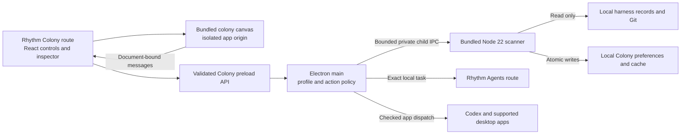

# Colony in Rhythm Electron

Date: 2026-09-18

Status: implementation plan; no Colony integration code has been written

Planning branch: `codex/colony-integration-plan` · [documentation draft #1539](https://github.com/ajhochy/Rhythm/pull/1539)

Audience: all Rhythm desktop users, explicitly opt-in

First platforms: macOS Apple Silicon and Intel

Tracking: [epic #1525](https://github.com/ajhochy/Rhythm/issues/1525) · [milestones and issue dependencies](2026-09-18-electron-colony-tracking.md)

## Goal and confirmed scope

Give Rhythm Electron users a Colony tab that shows their local agent work across harnesses,
opens the correct task, and feels like part of Rhythm. The installed Rhythm app must include
everything needed to run it; users should not need a terminal, a Bot Crossing checkout, or a
separate Node installation.

AJ confirmed all-user opt-in availability and both Mac architectures. AJ also requested a
design pass over the UI and menu items to make them feel native to Rhythm Electron, and
authorized filing this plan as GitHub issues with milestones. This run is planning and issue
creation only. It does not authorize implementation, merge, release publication, or Flutter
retirement.

Preserve the 3D colony, its art and animations, multi-harness discovery, stable repository and
checkout identity, parent/worker relationships, accurate unknown/quiet states, and local
archive/viewed/grouping preferences. Initial integration supports the adapters already present
in the adopted Bot Crossing revision; it does not promise every external app can reopen tasks.
Unsupported actions must explain why instead of opening an unrelated task.

Out of scope: Windows/Linux packages, cloud upload/sync of harness history, shared colonies,
automatic agent execution, a new scheduler, a new plugin marketplace, changing provider
credentials, deleting harness records, and replacing Rhythm's API/engine. Creating new external
sessions or resuming terminal sessions is not part of the first packaged Colony action contract;
those standalone actions remain outside the embedded menu until separately qualified.

## Constraints and design tensions

- Discovery reads harness files and Git metadata only. All writes belong to Colony's own
  profile-scoped state. Never treat a missing historical folder as a live project or blocked bot.
- Keep live API/engine ownership unchanged. A scanner is a separate child owned by this Electron
  instance; it never binds, stops, adopts, or reclaims ports 4001/4096 or any unrelated process.
- Flutter remains the shipping client under the current repository release policy. Completing
  Colony does not satisfy the separate Electron replacement/pilot/cutover gates.
- Reuse the existing renderer and scanner while replacing the surrounding controls with Rhythm
  components. Avoid an all-at-once React rewrite of the 3D simulation.
- Balance a useful large local inventory with responsive UI and bounded IPC. The observed local
  sample is about 15,500 sessions; cold scans can take tens of seconds. A loading state and cached
  snapshot are required, rather than a fictional instant-scan promise.
- Dark/light themes, keyboard operation, reduced motion, narrow windows and low-end GPUs matter.
  A searchable list remains usable when the 3D view is unavailable.

## Source evidence and prior art

Inspected Rhythm base: `2350a500fe87f4acdc429be4c181997f251ce4e3`. The companion exact-session
receiver is [draft PR #1538](https://github.com/ajhochy/Rhythm/pull/1538) on
`codex/electron-session-opening`; its reviewed change must be available before COL-06 closes.
Focused/native opening checks passed, but its broad monorepo gate reported three uninvestigated
failures outside the changed packages; the PR records those review limits. Bot source candidate is fork commit
`36d2c29989f567de0ac4d30a957610163cfc4d86`, including
[Bot Crossing draft #4](https://github.com/ajhochy/bot-crossing/pull/4). Adoption requires reviewing
that exact revision and its preceding stack; do not silently track a moving branch.

| Evidence | Reuse or implication |
| --- | --- |
| Bot `package.json`, `src/main.js`, `src/game/api.js` | Plain JS/Three.js/Vite; a small client transport seam wraps the HTTP API. Preserve state conflict handling when adding an embedded transport. |
| Bot `server/api.mjs:19`, harness adapters, project resolver | Existing `BOT_CROSSING_DATA` override and read-only adapter logic; extract shared operations, not a second scanner implementation. |
| Bot `LICENSE`, `README.md:901`, `public/assets` | MIT source, stated CC0 asset provenance and Apache-2.0 icons. Audit actual shipped inventory and retain required notices. Current assets are about 6.5 MB; full web dist about 7.7 MB before integration. |
| Rhythm `apps/web/src/App.tsx:44`, `components/Shell.tsx:6` | Existing workspace routing and navigation/overflow menu; add one destination within that shell. |
| Rhythm `apps/web/src/styles.css:1`, Tasks/Agents views | Existing theme tokens, typography, buttons, menu behavior and resizable list/inspector patterns are the visual authority. |
| Rhythm `pages/dashboard/LiveArtifactsShell.tsx:23` | Existing document-bound MessageChannel pattern and retained tab state; borrow lifecycle ideas, not the cloud artifact authorization model. Colony is local app content. |
| Rhythm `apps/electron/src/agent-server.mjs:36` | Bundled Node lookup and explicit child ownership; reuse proven lifecycle concepts without modifying API/engine ownership. |
| Rhythm `apps/electron/scripts/package-mac.mjs:48` | Existing Node 22 packaging and detached resources. Pin a Node 22 patch version that supports `node:sqlite` and test that capability. |
| Rhythm `.github/workflows/electron_release.yml:28` | Existing arm64/x64 jobs, signing/notarization and architecture-specific ZIPs. Extend this pipeline; do not add a competing release system or require a universal binary. |

Official Electron references support isolated renderer privileges, validated IPC senders,
document-bound message ports and custom asset protocols. They do not prove that a design works
on Rhythm's currently pinned Electron 33; the first executable slice must prove that compatibility.
Sources: [security](https://www.electronjs.org/docs/latest/tutorial/security),
[message ports](https://www.electronjs.org/docs/latest/tutorial/message-ports),
[protocols](https://www.electronjs.org/docs/latest/api/protocol), and
[signing/notarization](https://www.electronjs.org/docs/latest/tutorial/code-signing).
Do not depend on newly documented APIs absent from the pinned runtime (for example a newer
protocol request field) without a separate reviewed runtime upgrade.

Research was performed in this thread using existing source and primary documentation because
the requested research subagent could not start: the session's agent-thread limit was reached.
No broad external solution search or new dependency is required for the proposed architecture.

## Proposed architecture

1. Adopt a pinned, reviewable copy under proposed `apps/colony/` with `UPSTREAM.json`, notices,
   lockfile and reproducible asset inputs. Record the fork/upstream revisions and update procedure.
   Exclude developer state, credentials, source transcripts, user audio and local opener configs.
2. Extract a transport-neutral service facade from Bot's existing API operations. Keep standalone
   HTTP support working and add a bounded private child-process channel for embedded use. Neither
   renderer receives generic filesystem, shell, raw SQL, arbitrary HTTP, or process APIs.
3. Serve the bundled scene from a separate fixed origin such as `rhythm-colony://app`. This is
   bundled trusted application code, not a hosted live artifact. Use an isolated frame and a
   document-bound channel; renderer Node integration stays off, context isolation/sandbox and
   web security stay on. Register only required protocol privileges, never `bypassCSP`.
4. Rhythm React owns the toolbar, repository/task list, inspector, menus, settings and notices.
   Embedded mode suppresses Bot's duplicate page chrome. A typed scene interface exchanges
   selection, filters, viewport insets, theme, motion, visibility and camera commands. Keep the
   original standalone interface available; do not make two incompatible data models.
5. Start one scanner lazily after explicit opt-in and first use. Use the bundled Node executable
   and an absolute packaged entry point; never rely on PATH or a developer checkout in a package.
   Scanner startup has a version/capability handshake, timeout and bounded restart policy. Missing
   payload produces an actionable failure, not an external executable fallback.
6. Native actions originate in Rhythm controls and are validated by main. Resolve opaque task/
   checkout identifiers against the current scanner inventory; callers cannot supply a command,
   executable or arbitrary filesystem target. Rhythm selection uses the existing local-ID route;
   external app dispatch uses a harness-specific allowlist and reports launch errors.

### Contract and data rules

- Proposed methods: `snapshot.page`, `refresh`, `state.read`, `state.compareAndSwap`,
  `sources.read/update`, `openTask`, `revealCheckout`, `copyCheckoutPath`, and a user-selected
  `importStandaloneState` operation. Scene messages carry selection/camera intents only; no
  generic `execute` escape hatch. Exporting a screenshot uses an explicit user action and the
  normal host save path.
- Version the wire protocol and reject unsupported versions. Bound control requests to 64 KiB,
  responses/chunks to 1 MiB, and inventory pages to at most 250 records initially. State exchange
  uses bounded chunks with a 32 MiB total ceiling and one validated atomic commit; a large archive
  must not be truncated to fit an ordinary command. Make cancellation,
  request IDs, timeouts, stale-document rejection and snapshot generation explicit. These are
  proposed tested limits, not existing behavior; adjust with recorded fixture evidence if needed.
- Keep public scene DTOs to summary/status/identity/capability data. No raw transcripts, tokens,
  auth files or full environment go into renderer messages, diagnostic logs, telemetry or GitHub.
- Data goes under an app-managed `userData/colony/<local-profile-key>/` directory, never inside
  the signed app. Preserve stable IDs, archive/viewed timestamps and grouping overrides. Use
  versioned files, atomic replacement, backups and the existing three-way merge semantics.
- Opt-in and source toggles are local to the desktop profile/account; they are not organization
  defaults and do not sync to the hosted API. A new account/profile starts disabled. Sign-out or
  account switch revokes channels, stops the scanner and clears displayed data from memory.
- Git enrichment is optional: a clean Mac without Git/developer tools still shows local tasks and
  paths, with unknown repository metadata where needed. Do not trigger an OS developer-tools
  installation prompt or fetch Git at runtime.
- Each source can be disabled before reading its store. Missing/locked/malformed sources show
  individual diagnostics; one failed adapter cannot blank all other results.
- Archive means **Archive from Colony**, with a reversible local preference. It never archives,
  resumes, deletes or mutates a source conversation. Import is an explicit preview/merge, never
  an automatic move or modification of the standalone files.

## Rhythm-native design brief

**Mode:** Operate. The user should identify which task needs attention and open it with minimum
effort. The 3D scene provides orientation and personality; text controls remain clear and usable.

**Visual authority:** Rhythm's current Electron Tasks/Agents shell, tokens and components. Keep
the existing colony world and character art. Do not transplant Bot's independent orange control
system, duplicate header, global settings menu or floating full-detail card into the final tab.

| Surface | Planned native treatment |
| --- | --- |
| App navigation | One `Colony` destination using existing navigation and overflow behavior; hidden until enabled. Deep-linking while disabled opens its enablement explanation without scanning. |
| Main workspace | Resizable repository/task rail, central scene, optional right inspector; keyboard-adjustable splitters with bounds, persistence and reset. Collapse panes gracefully at the supported minimum window width. |
| Toolbar | Search, harness/activity filters and a compact status summary. Label repositories, other workspaces and historical locations separately; historical locations remain off by default. |
| Selection | Clicking a bot or list row selects the same task and opens the same inspector. Show title, harness, status/freshness, repository and checkout first; branch, path and evidence remain readable/copyable. |
| Actions | Primary `Open in Rhythm` or `Open in Codex`; `Show parent task` for a worker. Secondary actions live in the existing menu style. Show an explicit disabled reason when exact reopening is unsupported. |
| View menu | Reset camera, focus selection, orbit, planet/time, sound, quality and screenshot. Use text labels, checked states and existing menu keyboard behavior; move advanced controls out of the main toolbar. |
| Task menu | Open, show parent, mark viewed/unviewed, archive/restore **from Colony**, show checkout in Finder and copy checkout path. No ambiguous destructive `Archive` label. |
| Settings | `Enable Colony on this Mac`, source toggles, local-data explanation, import preview, graphics/motion/sound preferences and a clear disable action. |
| Empty/error states | First enablement, no supported harness, no matches, all archived, disabled source, permission denial, stale snapshot, unavailable native app, scanner crash and unavailable WebGL each have a useful explanation/action. |
| Accessibility | Searchable keyboard-operable list equivalent to the scene, visible focus, Escape dismissal/focus return, screen-reader status labels, reduced motion, and sufficient contrast in dark/light themes. |

Design deliverables for COL-04: an action/menu inventory, before/after mapping, annotated desktop
compositions at 1440×900 and 1024×700, a narrow 800×600 layout, dark/light examples and selected,
empty/error states. Define behavior at 200% text zoom. Implementation must reuse incumbent
tokens/components or a small shared extraction, not duplicate lookalike CSS. App menu or shortcut
changes are scoped to Colony and must not steal text-input, terminal, or existing app shortcuts.

## Milestones and issue sequence

Issue IDs below are planning IDs, to be replaced with GitHub links after filing. Each issue body
contains observable criteria, likely files, tests, boundaries and explicit prerequisites.

| Order | ID / title | Milestone | Dependencies | Files / evaluation |
| --- | --- | --- | --- | --- |
| 1 | COL-01 Adopt pinned Bot Crossing source and asset provenance | M1 Foundation and local runtime | Reviewed Bot source revision | `apps/colony/`, import tooling, notices; reproducible build and read-only adapter regressions |
| 2 | COL-02 Add the embedded service/scene contracts and isolated bridge | M1 | COL-01 | Colony service/client seam, Electron protocol/preload; real Electron hostile-frame and bounded-message tests |
| 3 | COL-03 Manage the owned local scanner and source discovery | M1 | COL-02 | Electron scanner service, source settings contract; process ownership, crash, disabled-source and large inventory tests |
| 4 | COL-04 Design the native Colony workspace and menu system | M2 Rhythm-native experience | Confirmed brief; parallel with M1 | Design brief/comps/action inventory; review against actual Tasks/Agents UI |
| 5 | COL-05 Build the native tab, task rail and inspector | M2 | COL-02, COL-04 | React Colony route, Shell, scene adapter; rendered parity, splitters, narrow/dark/light states |
| 6 | COL-06 Connect task actions and native menus | M2 | COL-03, COL-05, reviewed session-opening receiver | Main action policy, route selection, menus; exact task/worker navigation and error tests |
| 7 | COL-07 Add local opt-in, preferences and reversible import | M2 | COL-03, COL-05 | Local profile store, Settings, state merge; account isolation, import preview, corruption/CAS/rollback tests |
| 8 | COL-08 Finish resource behavior, accessibility and recovery | M2 | COL-05, COL-06, COL-07 | Scene lifecycle and native states; hidden-tab resource checks, keyboard and failure fixtures |
| 9 | COL-09 Include Colony in the self-contained Mac package | M3 Packaged Mac builds | COL-03, COL-07, COL-08 | Packager, manifest, resources; no-checkout/no-system-Node/offline package smoke |
| 10 | COL-10 Extend arm64/x64 signing and release CI | M3 | COL-09 | Existing Electron release workflow and signer; both native artifacts, hashes/notices and post-sign smoke |
| 11 | COL-11 Qualify the installed signed builds | M4 Installed acceptance and rollout | COL-06, COL-08, COL-10 | Native installed smoke on both architectures; real Keychain/auth, tasks, source safety, upgrade/rollback evidence |
| 12 | COL-12 Document and gate the all-user opt-in release | M4 | COL-11; separate host release readiness | Release checklist, support docs and local feature switch; approved prerelease/pilot evidence and rollback drill |

COL-04 may start while M1 runs. COL-05 can develop against the bounded fixture contract, but M2
does not close until it works through the real owned scanner. Package work starts from stable
contracts; signed release acceptance is serial after functional integration. Use separate feature
branches/draft PRs for slices, with explicit dependency links and human merge.

## Packaging, upgrades and release definition

Extend `package-mac.mjs` to build/pin the Colony renderer, stage a minimal scanner payload and
copy notices into immutable resources. Reuse the existing bundled Node 22 for its separate child;
validate its exact patch version, architecture and `node:sqlite` support. Development fallback is
allowed only in explicit dev mode. A packaged app with missing resources must fail clearly.

Extend the current `electron_release.yml` matrix, retaining separate `Rhythm-arm64.zip` and
`Rhythm-x64.zip` artifacts and the current Electron prerelease channel. Record source revisions,
lockfile/build input hashes, packaged file inventory, asset size delta and SHA-256 for each final
archive. Scrub build environment overrides and scan the payload for developer paths, fixtures,
tokens and user data. Never fetch packages, artwork or tools at first run.

Keep nested signing/notarization/stapling and post-sign smoke in the existing pipeline. Test the
actual distributed archive after extraction/installation with no repo checkout or development
PATH. Native signing/Keychain and installed x64 behavior cannot be qualified by browser tests,
an ad-hoc signature, or an arm64 build alone. A signing-secret or Intel-machine gap remains an
open release gate, not a skipped pass.

Updates replace app resources only. User state stays outside the bundle. Migrations are
versioned/backed up; a previous compatible app can restore/read the documented backup without
touching harness stores. Feature disablement stops only the owned scanner and preserves local
preferences; re-enabling restores them. Do not add an independent updater inside Colony. If the
host uses manual prerelease ZIP replacement, test that exact path rather than claiming automatic
update coverage.

## Validation and acceptance gates

1. **Contracts:** falsifiable tests for exact selection, source read-only behavior, state merges,
   local enablement, revoked channels, missing resources and process ownership. Synthetic fixture
   IDs only in committed evidence. Normal app startup while disabled performs zero harness reads.
2. **Rendered integration:** real click/keyboard inputs select the same list/scene/inspector task;
   menus, theme, resizing and failure states match Rhythm conventions. Native app smoke must prove
   the selected task's visible identity, not merely that a dispatch returned success.
3. **Resource checkpoint:** 15,000-session synthetic inventory plus a recorded authorized local
   sample. Keep the first shell frame responsive while scanning. Cached inventory visible within
   2 seconds on recorded reference hardware; show progress by 1 second during cold work and a
   stale/cancel/retry state at a bounded 60-second timeout. A 100-task render fixture targets at
   least 30 FPS on the low preset on both recorded Macs. These are proposed acceptance budgets.
4. **Hidden and failure behavior:** within 1 second of leaving/minimizing the tab, stop scene
   animation/audio and scheduled scans; retain selection/camera. Returning refreshes stale data
   without a second scanner. Twenty tab switches must not accumulate workers, WebGL contexts or
   listeners. WebGL failure preserves all essential task actions through the native list.
5. **Host checks:** run affected package checks at slice checkpoints and the documented issue/PR
   gates at integration checkpoints. Do not run the full monorepo suite after each cosmetic edit.
   Report unrelated baseline failures accurately. Never weaken assertions to obtain green output.
6. **Packaged release:** both exact signed architecture artifacts must pass startup, opt-in/off,
   populated/empty sources, task opening, quit/relaunch, absent external app, scanner crash,
   upgrade and rollback. Verify checksums after download; record artifact/version/OS/CPU evidence.
7. **Rollout:** all-user availability means a local opt-in feature in the approved Electron
   distribution. Default remains off. No hosted API, database schema or Flutter cutover change is
   included. A feature acceptance checklist and the host's release approval are separate gates.

## Known decisions for the first slices

The architecture and UI direction above are the recommended plan, not implemented facts. COL-02
must prove custom-origin asset loading, message lifetime and the existing Electron 33 runtime
before downstream work relies on them; a failure requires updating this plan, not weakening CSP.
COL-04 resolves detailed layout/menu placement within the confirmed Rhythm visual system. The
source revision, supported minimum macOS version and exact Node patch are captured as pinned
build inputs during COL-01/COL-09, using current host policy rather than new unsupported promises.

## Planning checklist

- [x] Confirm audience, opt-in rollout and both Mac architectures.
- [x] Incorporate the requested native UI/menu design pass.
- [x] Inspect source, packaging, visual authority and primary prior art.
- [x] Separate runtime/behavior, packaged artifacts and release qualification.
- [x] Define ordered slices, acceptance criteria and verification boundaries.
- [x] Generate 12 issue files with 48 acceptance criteria and validate acyclic dependencies.
- [x] Create four GitHub milestones, epic #1525 and issues #1526–#1537; verify bodies and assignments.
- [x] Publish documentation draft #1539 and record the run (Dev Dashboard revision 4228); implementation remains unstarted.
